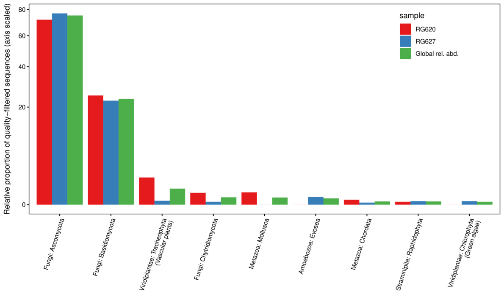
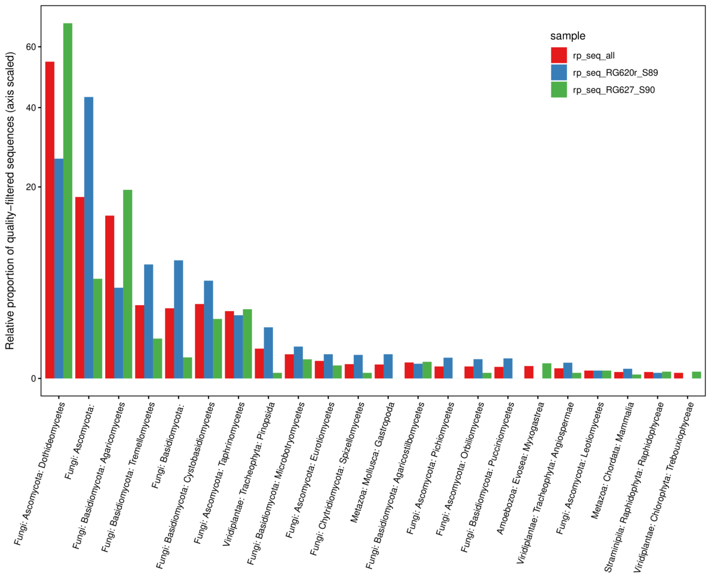

#  Rain gauge sequencing, 2025.01.12
**Caption:** 



**Caption:** Relative abundance by eukaryotic kingdom and phylla as estimated by 18S rDNA sequence counts for two rain gauges at Hubbard Brook Experimental Forest.

**Notes:**   

- This was meant to be proof of concept based on my conversations with John (thus only two rain gauge samples were processed). Still, there is broad correspondence among the two samples, which is encouraging.

- Estimating  abundance using sequence counts is challenging and somewhat fraught since there can some primer bias and differences in copy number (for 18S) that can skew the results.  That said, the primers we used are meant to be universal across eukaryotes, and using 18S rDNA means that the copy number is at least not influenced by ribosome count (which can scale with metabolic activity or growth rate/phase). Copy number does not appear to differ systematically among eukaryotic kingdoms and phylla, so at this scale of analysis it is pretty defensible as a rough cut.  It would be less useful for individual taxa. **Eric, please comment on whether this makes sense.**

- Given this, I think we can say with some confidence that what organically-derived carbon in rain gauges is primarily of fungal origin:  Ascomycota (75.2%); Basidiomycota (23.5%), and Chytridiomycota (0.1%).  Vascular plants (pollen?) represented 0.5% of sequences and green algae <0.1%.  

- **Eric:** Is there any metadata available (when where the gauges out and for how long?). This could greatly affect the likelihood of certain kinds of pollen, for example, as could their placement in the forest/landscape.

- This is all very interesting but drilling down, a full 52.2% of the sequences are Aureobasidium sp. (Dothideales: Saccotheciaceae). Difficult to know what species but this is a yeast-like fungus that grows ubiquitously.  It seems very likely that it was actively growing in the rain gauge, which would totally skew the sequence counts.  It is very likely a contaminant.

  ```
  Aureobasidium pullulans is a ubiquitous and generalistic black, yeast-like fungus that can be found in different environments (e.g. soil, water, air and limestone). It is well known as a naturally occurring epiphyte or endophyte of a wide range of plant species (e.g. apple, grape, cucumber, green beans, cabbage) without causing any symptoms of disease.[1] A. pullulans has a high importance in biotechnology for the production of different enzymes, siderophores and pullulan.[2] Furthermore, A. pullulans is used in biological control of plant diseases, especially storage diseases.[3][4]
  
  Chronic human exposure to A. pullulans via humidifiers or air conditioners can lead to hypersensitivity pneumonitis (extrinsic allergic alveolitis) or "humidifier lung". This condition is characterized acutely by dyspnea, cough, fever, chest infiltrates, and acute inflammatory reaction. The condition can also be chronic, and lymphocyte-mediated. The chronic condition is characterized radiographically by reticulonodular infiltrates in the lung, with apical sparing. The strains causing infections in humans were reclassified to A. melanogenum.[5]
  ```

  https://en.wikipedia.org/wiki/Aureobasidium_pullulans

  

- We could just remove this species but this does beg the question of how many of the dominant species are dominant because the rain gauge as habitat, not a passive collection "cup."  Pollen of course won't grow in rainwater (and might even break down, see below) . There is a risk that this analysis systematically over-estimates the relative importance of fungi in these samples.
  - We could put salt or some other compound in a few gauges to stop fungal growth and see what drops out/becomes less abundance, but this is a whole other project.
  - We could try and filter out likely contaminants.  The second most sequence rich taxon is "Ascomycota sp." for which of course we have no basis for inclusion or exclusion. 
  - Looking up the Chytridiomycota, which also grow in water, the two ASV's we found map to the Order Spizellomycetales. Turns out they break down pollen too...this could mean both that they are growing in the rain gauges AND (unfortunately) that they are decomposing any pollen present.
    - **Spizellomycetales** is an [order](https://en.wikipedia.org/wiki/Order_(biology)) of [fungi](https://en.wikipedia.org/wiki/Fungi) in the [Chytridiomycetes](https://en.wikipedia.org/wiki/Chytridiomycetes). Spizellomycetalean chytrids are essentially ubiquitous [zoospore](https://en.wikipedia.org/wiki/Zoospore)-producing fungi found in soils where they decompose pollen. Recently they have also been found in dung and harsh alpine environments, greatly expanding the range of habitats where one can expect to find these fungi.[[2\]](https://en.wikipedia.org/wiki/Spizellomycetales#cite_note-Freeman-2)[[3\]](https://en.wikipedia.org/wiki/Spizellomycetales#cite_note-Wakefield-3)[[4\]](https://en.wikipedia.org/wiki/Spizellomycetales#cite_note-Simmons-4)
  - All this said, I ***still*** think we've effectively shown that pollen is not in great abundance in these (two) rainwater samples, which was the point of the study. There are lots of caveats though, and pollen abudance could fluctuate dramatically across the season too.  
  - It is worth considering (can of worms warning) whether an how fungal growth in rainwater affects (our perception of) rainwater chemistry, including how it varies seasonally and with temperature/length of collection.

- Trichaptum abietinum is the third most abundant thing by sequence count (4.6%).  This one seems unlikely to be growing in rainwater.

  - ***Trichaptum abietinum*** is a [species](https://en.wikipedia.org/wiki/Species) of [poroid](https://en.wikipedia.org/wiki/Polypore) [fungus](https://en.wikipedia.org/wiki/Fungus) in the order [Hymenochaetales](https://en.wikipedia.org/wiki/Hymenochaetales). It is [saprophytic](https://en.wikipedia.org/wiki/Saprophytic), growing from dead [conifer](https://en.wikipedia.org/wiki/Conifer) wood.

    The white-gray [cap](https://en.wikipedia.org/wiki/Pileus_(mycology)) is 1–4 cm wide and usually no more than 0.5 cm thick, shelved and fanlike, with brownish and leathery [flesh](https://en.wikipedia.org/wiki/Trama_(mycology)).[[2\]](https://en.wikipedia.org/wiki/Trichaptum_abietinum#cite_note-:0-2) The [spores](https://en.wikipedia.org/wiki/Basidiospore) are white, cylindrical, and smooth.[[2\]](https://en.wikipedia.org/wiki/Trichaptum_abietinum#cite_note-:0-2)

    The species is inedible.[[2\]](https://en.wikipedia.org/wiki/Trichaptum_abietinum#cite_note-:0-2)

    Similar species include *[Trichaptum biforme](https://en.wikipedia.org/wiki/Trichaptum_biforme)*, *[Bjerkandera adusta](https://en.wikipedia.org/wiki/Bjerkandera_adusta)*, and *[Trametes versicolor](https://en.wikipedia.org/wiki/Trametes_versicolor)*.[[2\]](https://en.wikipedia.org/wiki/Trichaptum_abietinum#cite_note-:0-2)


------------------------------



**Caption:** Showing here by class.  The Pinopsida is Pinus spp. Probably white pine pollen?  It's perhaps a non-trivial amount, especially if we were to remove the Dothideomycetes column since that is likely contamination.
